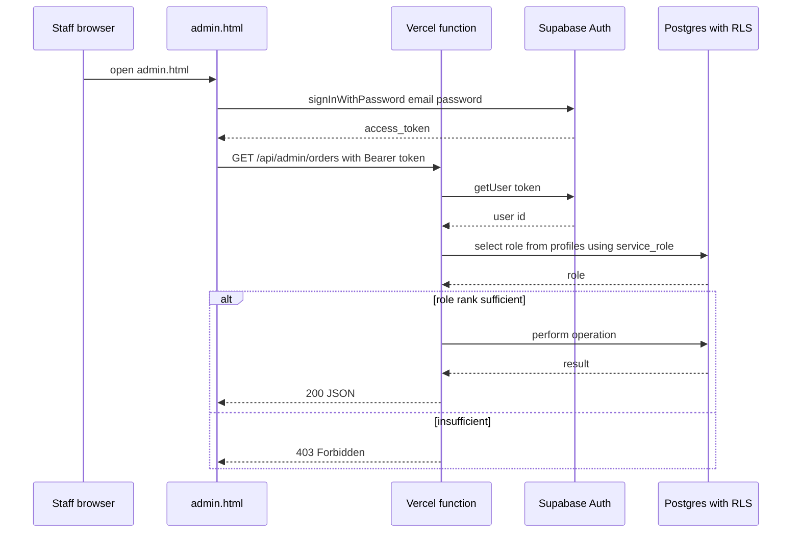

# Pomelo Shop — Three-Tier RBAC Design

Status: **Draft for approval**
Author: Architect mode
Related: [`supabase/migrations/0001_pomelo_orders.sql`](../supabase/migrations/0001_pomelo_orders.sql), [`api/config.js`](../api/config.js), [`app.js`](../app.js)

---

## 1. Goal

Add a three-tier role system to Pomelo Shop, modelled on the RBAC patterns in
`open-play-sports-booking` but simplified to three roles:

| Role | Permissions |
| --- | --- |
| **owner** | Everything: edit page text + catalogue, manage orders, grant/revoke admin & user roles, **modify** sensitive settings (PromptPay ID, bank info) |
| **admin** | Manage products & orders. **Cannot modify** sensitive/bank info (PromptPay ID, bank details) — but may **view** it |
| **user** | View the order list, update fulfilment status (arrange shipping) |

Authentication: **Email + password via Supabase Auth** (no email infrastructure).
Admin UI: **new static pages** (`login.html`, `admin.html`) calling **Vercel
serverless functions** that use the `service_role` key.
Sensitive settings: stored in a **`pomelo_settings` table**, owner-only RLS.
First owner: **SQL seed** in the migration (fixed email), password set later.

---

## 2. Current state vs. target

### Today (no auth)
```
Buyer ──► index.html ──► /api/config ──► { supabaseUrl, supabaseAnonKey,
                                            promptPayId, shopName }
                     └──► Supabase (anon key, INSERT-only on pomelo_orders)
```

- No `auth.users`, no `profiles`, no login.
- `PROMPTPAY_ID` comes from an env var and is served to **every** browser via
  [`api/config.js`](../api/config.js:24) so the QR can be generated client-side.

### Target (with RBAC)
```
Buyer ──► index.html ──► /api/config ──► { supabaseUrl, supabaseAnonKey,
                                            promptPayId, shopName }   (unchanged)

Staff ──► login.html ──► Supabase Auth (email + password)
      └─► admin.html ──► /api/admin/* (Vercel fns, service_role, role-checked)
                          ├─ list/update orders
                          ├─ manage catalogue
                          ├─ manage roles        (owner only)
                          └─ manage settings     (owner only)
```

---

## 3. Data model

### 3.1 `public.profiles` (new)

Extends `auth.users`, mirroring open-play's
[`0004_auth_and_rbac.sql`](../../open-play-sports-booking/supabase/migrations/0004_auth_and_rbac.sql:10).

```sql
create table if not exists public.profiles (
  id         uuid primary key references auth.users (id) on delete cascade,
  email      text,
  full_name  text,
  role       text not null default 'user'
             check (role in ('user', 'admin', 'owner')),
  created_at timestamptz not null default now()
);

create index if not exists profiles_role_idx on public.profiles (role);
```

Auto-create a profile on signup via a trigger (same as open-play):

```sql
create or replace function public.handle_new_user()
returns trigger language plpgsql security definer set search_path = public
as $$
begin
  insert into public.profiles (id, email, full_name)
  values (new.id, new.email,
          coalesce(new.raw_user_meta_data ->> 'full_name', new.email))
  on conflict (id) do nothing;
  return new;
end; $$;

drop trigger if exists on_auth_user_created on auth.users;
create trigger on_auth_user_created
  after insert on auth.users
  for each row execute procedure public.handle_new_user();
```

### 3.2 `public.pomelo_settings` (new)

Holds sensitive settings. **Everyone may read** (the storefront needs the
PromptPay ID to build the QR, and staff may view it); **only the owner may
write**. Key/value so new settings need no migration.

```sql
create table if not exists public.pomelo_settings (
  key        text primary key,
  value      text not null,
  updated_at timestamptz not null default now(),
  updated_by uuid references auth.users (id) on delete set null
);

alter table public.pomelo_settings enable row level security;

-- Public read: the storefront (anon) and all staff need the PromptPay ID.
create policy "settings_public_read" on public.pomelo_settings
  for select to anon, authenticated
  using (true);

-- Owner-only write (insert/update/delete).
create policy "settings_owner_write" on public.pomelo_settings
  for all to authenticated
  using (exists (select 1 from public.profiles p
                 where p.id = auth.uid() and p.role = 'owner'))
  with check (exists (select 1 from public.profiles p
                      where p.id = auth.uid() and p.role = 'owner'));
```

Seed the PromptPay ID (owner can change it later from the UI):

```sql
insert into public.pomelo_settings (key, value)
values ('promptpay_id', 'REPLACE_WITH_REAL_ID')
on conflict (key) do nothing;
```

### 3.3 `public.pomelo_orders` (existing — add RLS for staff)

Today anon may INSERT only. Add SELECT/UPDATE for staff so `admin.html` can list
and update orders **through the anon key + RLS** (defence in depth; the Vercel
functions also use `service_role`).

```sql
-- Staff (any role) may read orders.
create policy "orders_staff_read" on public.pomelo_orders
  for select to authenticated
  using (exists (select 1 from public.profiles p
                 where p.id = auth.uid()
                   and p.role in ('user','admin','owner')));

-- Staff may update status/note (fulfilment). Owner/admin may update anything.
create policy "orders_staff_update" on public.pomelo_orders
  for update to authenticated
  using (exists (select 1 from public.profiles p
                 where p.id = auth.uid()
                   and p.role in ('user','admin','owner')))
  with check (true);
```

> Note: column-level restriction (a `user` may only change `status`/`note`, not
> `total_satang`) is enforced in the **serverless function**, not RLS. RLS is
> row-level only. See §5.

### 3.4 `public.pomelo_catalogue` (new — optional but recommended)

Today the catalogue is hard-coded in [`app.js`](../app.js:20). To let `admin`
"manage products", move it to a table:

```sql
create table if not exists public.pomelo_catalogue (
  sku        text primary key,
  label      text not null,
  unit_price integer not null check (unit_price >= 0),  -- THB
  sort_order integer not null default 0,
  active     boolean not null default true
);

alter table public.pomelo_catalogue enable row level security;

-- Public read (the storefront needs it).
create policy "catalogue_public_read" on public.pomelo_catalogue
  for select to anon, authenticated using (true);

-- Owner/admin write.
create policy "catalogue_staff_write" on public.pomelo_catalogue
  for all to authenticated
  using (exists (select 1 from public.profiles p
                 where p.id = auth.uid() and p.role in ('admin','owner')))
  with check (exists (select 1 from public.profiles p
                      where p.id = auth.uid() and p.role in ('admin','owner')));
```

Seed with the current two SKUs:

```sql
insert into public.pomelo_catalogue (sku, label, unit_price, sort_order) values
  ('5kg',  '5 kg 装',  180, 1),
  ('10kg', '10 kg 装', 330, 2)
on conflict (sku) do nothing;
```

### 3.5 `public.pomelo_page_content` (new — for "edit page text")

```sql
create table if not exists public.pomelo_page_content (
  key        text primary key,   -- e.g. 'hero_title', 'hero_subtitle'
  value      text not null,
  updated_at timestamptz not null default now()
);

alter table public.pomelo_page_content enable row level security;

create policy "content_public_read" on public.pomelo_page_content
  for select to anon, authenticated using (true);

create policy "content_owner_write" on public.pomelo_page_content
  for all to authenticated
  using (exists (select 1 from public.profiles p
                 where p.id = auth.uid() and p.role = 'owner'))
  with check (exists (select 1 from public.profiles p
                      where p.id = auth.uid() and p.role = 'owner'));
```

> "Edit page text" is **owner-only** per your spec.

---

## 4. PromptPay ID visibility (clarified)

Per the owner's clarification: the PromptPay ID and similar settings are
**readable by everyone** but **modifiable only by the owner**. This matches
reality — the buyer page generates the QR client-side, so the ID is already
public by necessity.

Enforcement is therefore **write-only access control**:

- The **storefront** receives `promptPayId` from `/api/config` (public) — unchanged.
- The **admin UI** shows the settings panel to all staff as **read-only**, with
  the edit controls enabled only for the owner.
- The **`/api/admin/settings`** function allows `GET` for any staff role and
  rejects `PUT` from non-owners.
- The **`pomelo_settings`** table is public-read / owner-write via RLS.

No server-side QR generation is needed, since the ID is not treated as a secret.

---

## 5. Serverless API (Vercel functions)

All under `api/admin/`. Every function:

1. Reads the caller's Supabase access token from the `Authorization: Bearer …`
   header.
2. Verifies it with the **anon** client (`supabase.auth.getUser(token)`).
3. Loads the caller's `profiles.role` with the **service_role** client.
4. Rejects if the role is insufficient (never trust the client).
5. Performs the operation with the **service_role** client.

New env var required: **`SUPABASE_SERVICE_ROLE_KEY`** (server-only, never sent to
the browser).

| Endpoint | Method | Min role | Purpose |
| --- | --- | --- | --- |
| `/api/admin/orders` | GET | user | List orders (paginated) |
| `/api/admin/orders` | PATCH | user | Update `status` / `note` only |
| `/api/admin/orders` | PATCH | admin | Update any order field |
| `/api/admin/catalogue` | GET | user | List catalogue |
| `/api/admin/catalogue` | POST/PATCH/DELETE | admin | Manage products |
| `/api/admin/content` | GET | user | Read page content |
| `/api/admin/content` | PUT | owner | Edit page text |
| `/api/admin/settings` | GET | user | Read PromptPay ID, bank info |
| `/api/admin/settings` | PUT | owner | Modify PromptPay ID, bank info |
| `/api/admin/users` | GET | owner | List staff accounts |
| `/api/admin/users` | POST/PATCH | owner | Grant/revoke admin & user roles |

### Shared helper: `api/admin/_auth.js`

```js
// Pseudocode — verifies token, returns { user, role } or throws 401/403.
export async function requireRole(req, minRole) {
  const token = (req.headers.authorization || "").replace(/^Bearer /, "");
  if (!token) throw httpError(401, "Missing token");

  const anon = createClient(process.env.SUPABASE_URL, process.env.SUPABASE_ANON_KEY);
  const { data: { user }, error } = await anon.auth.getUser(token);
  if (error || !user) throw httpError(401, "Invalid token");

  const admin = createClient(process.env.SUPABASE_URL, process.env.SUPABASE_SERVICE_ROLE_KEY);
  const { data: profile } = await admin.from("profiles")
    .select("role").eq("id", user.id).maybeSingle();
  const role = profile?.role ?? "user";

  const rank = { user: 1, admin: 2, owner: 3 };
  if (rank[role] < rank[minRole]) throw httpError(403, "Insufficient role");
  return { user, role, admin };
}
```

---

## 6. Front-end pages

### 6.1 `login.html` (new)

- Email + password form.
- Calls `supabase.auth.signInWithPassword()` using the anon key from `/api/config`.
- On success, stores the session (supabase-js persists it in `localStorage` by
  default) and redirects to `admin.html`.
- Shows a friendly error on bad credentials.

### 6.2 `admin.html` (new)

Single page, tabs shown/hidden by role:

| Tab | user | admin | owner |
| --- | :---: | :---: | :---: |
| Orders (list + status/note) | ✅ | ✅ | ✅ |
| Catalogue | — | ✅ | ✅ |
| Page text | — | — | ✅ |
| Settings (PromptPay / bank) | 👁 read-only | 👁 read-only | ✏️ read + write |
| Staff & roles | — | — | ✅ |

- Reads the session from supabase-js, sends `Authorization: Bearer <access_token>`
  to every `/api/admin/*` call.
- On 401, redirects to `login.html`.
- On 403, hides the offending tab (defence in depth — the API is the real gate).

### 6.3 `index.html` (modified)

- Catalogue: fetch from `pomelo_catalogue` (public read) instead of the hard-coded
  array, falling back to the current array if the table is empty/unreachable.
- Page text: fetch from `pomelo_page_content` (public read) and apply to the
  relevant elements.
- PromptPay ID: unchanged (still from `/api/config`).

---

## 7. Bootstrapping the first owner

In the migration, seed a fixed owner email:

```sql
-- The owner signs up via login.html (or the Supabase dashboard) with this email,
-- then this statement promotes them. Run it AFTER the account exists.
update public.profiles
set role = 'owner'
where email = 'REPLACE_WITH_OWNER_EMAIL';
```

Because the account may not exist when the migration first runs, the promotion is
a **separate, idempotent statement** the operator runs once after creating the
owner account. Documented in the README.

---

## 8. Security summary

| Concern | Mitigation |
| --- | --- |
| Client tampering with role | Role re-checked server-side in every `/api/admin/*` call |
| `service_role` key leak | Server-only env var; never referenced in client code or `/api/config` |
| Admin **modifying** bank info | `pomelo_settings` RLS = owner-write; `/api/admin/settings` PUT = owner-only |
| Admin **reading** bank info | Allowed by design (the ID is public via the QR anyway) |
| User editing prices | `/api/admin/orders` PATCH whitelists `status`/`note` for `user` |
| Anon reading orders | No anon SELECT policy on `pomelo_orders` (unchanged) |
| Owner lockout | Owner role can only be changed by another owner; seed statement is idempotent |

---

## 9. Migration plan (single new file)

`supabase/migrations/0002_pomelo_rbac.sql`:

1. `profiles` table + trigger + index
2. `pomelo_settings` table + owner-only RLS + seed
3. `pomelo_catalogue` table + public-read/staff-write RLS + seed
4. `pomelo_page_content` table + public-read/owner-write RLS + seed
5. `pomelo_orders` staff SELECT/UPDATE policies
6. Owner-promotion statement (commented, run manually)

All statements idempotent (`if not exists`, `drop policy if exists`, `on conflict
do nothing`).

---

## 10. Open questions / future work

- **Server-side QR generation** to make the PromptPay ID genuinely secret (§4).
- **Audit log** of role changes and settings edits (a `pomelo_audit` table).
- **Password reset** flow (needs email; out of scope for email+password MVP).
- **Rate limiting** on `login.html` (Supabase has built-in auth rate limits).

---

## 11. Mermaid — request flow


